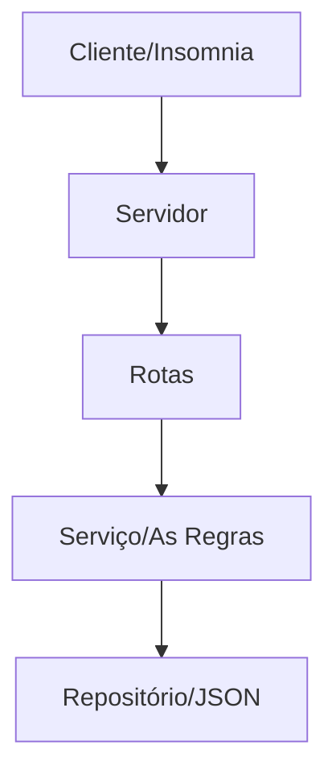

# O Servidor
Para a criação do sistema, imaginei uma API básica de clientes com uma quantia de dinheiro.


## Sumário 
* [Descrição](https://github.com/Leo-alt-f4/api/tree/Ajustes-novos/#descri%C3%A7%C3%A3o)

* [Atualizações](https://github.com/Leo-alt-f4/api/tree/Ajustes-novos/#atualiza%C3%A7%C3%B5es)
    * controllers
    * dtos
    * entities
    * errors
    * repositories

* [Seu-Sistema](https://github.com/Leo-alt-f4/api/tree/Ajustes-novos/#seu-sistema)
    * `usuarios.json`
    * `user.entity.ts`
    * `create-user.dto.ts`
    * `update-user.dto.ts`
    * `AppError.ts`
    * `users.repository.ts`
    * `users.service.ts`
    * `users.controller.ts`
    * `user.routes.ts`
    * `server.ts`

* [Rotas](https://github.com/Leo-alt-f4/api/tree/Ajustes-novos/#rotas)
    * Servidor
    * Processamento
    * Resposta

* [Uso de POO](https://github.com/Leo-alt-f4/api/tree/Ajustes-novos/#uso-de-poo)
    * Classes e Objetos
    * Encapsulamento
    * Abstração
    * Dependências

* [Principais dúvidas](https://github.com/Leo-alt-f4/api/tree/Ajustes-novos/#principais-d%C3%BAvidas)

* [Como Utilizar](https://github.com/Leo-alt-f4/api/tree/Ajustes-novos/#como-utilizar)


## Descrição
O código em si utiliza-se de bibliotecas como:

* Node.js
    * Crypto
    * Path
    * fs
* Express
    * Request
    * Response
    * Router 
    * NextFunction


## Atualizações
#### Controller
Onde antes o sistema de rotas tratava de checar se um método, como a `getUserById` e o status do servidor, estavam ativos, na `users.controller` ela realiza estas buscas e checagens, deixando o sistema de rotas somente com os 'links' de cada função (get, post, patch e delete).  
    
#### Dtos
Tem como a funcionalidade de exportar os valores de criação e atualização, assim, não sendo necessário em cada arquivo, gerar uma base do `usuários.json` para funcionar o sistema.

#### Entities
Está armazenando tanto o arquivo com os dados de usuário, quanto quem trata de transformar os dados do usuário, para serem lidos em todo o sistema (o `users.entity`).

#### Errors
Possui uma função simples de tratamento de erros, retornando ao usuário as falhas ocorridas durante o código

#### Repositories
Faz o sistema de CRUD que gera e joga os dados para serem armazenados na `usuarios.json` realizados no servidor.


## Seu Sistema
#### `usuarios.json`
Está todo o sistema de usuários, onde cada um possui um id (numérico), nome (string), sobrenome (string), quantidade (numérico) e tipo (string, podendo ser 'positivo', 'negativo' e 'neutro').
usuarios.json

-----------------------------------------------------------------------------------------------

#### `user.entity.ts`
É onde possui as ações de alteração dos usuários (provindos da `usuario.json`), servindo para ler, criar, atualizar e deletar.

O sistema primeiramente busca separar os sistemas de id, nome, quantidade, sobrenome e tipo, dentro de um constructor, o que torna mais fácil a busca por usuário.
A partir da constructor, é realizada a criação de métodos para a atualização das propriedades, que irão servir tanto para funções de criar e atualizar usuários, trazendo uma eficácia e legibilidade para o código.

-----------------------------------------------------------------------------------------------

#### `create-user.dto.ts`
Serve para exportar os valores base de um usuário, sendo o nome, sobrenome, quantity, tipo e email. Todos, exceto pela quantidade, são do tipo _string_ (texto), a quantidade é do tipo númerico(_Number_), por se tratar de valores no qual o usuário possui.

-----------------------------------------------------------------------------------------------

#### `update-user.dto.ts`
A `update-user` possui a funcionalidade parecida com a `create-user`, exceto pelo fato de que os valores não precisam existir (ou serem alterados). Com isso, os dados possuem uma interrogação ao lado, ditando ao sistema que aquele valor pode ou não existir.

```TypeScript
export interface UpdateUserDto {
  /*
    (property) UpdateUserDto.name?: string | undefined
  */
  name?: string;
  // resto do código...
```

-----------------------------------------------------------------------------------------------

#### `AppError.ts`
Tem uma base simples, no qual serve somente para retornar os erros ocorridos durante o código, seja na criação de um usuário, a atualização ou na busca pelo mesmo.


**Exemplo:**
```TypeScript
/* 
    Código da users.repository.ts
    essa função abaixo, trata de atualizar o usuário,
    checado dado por dado.
*/
public updateUser(id: string, data: UpdateUserDto): User {
    const user = this.usersRepository.findById(id);

    // Caso o sistema perceba que o id do usuário está errado, 
    // ele joga este erro para a AppError mostrar ao usuário
    if (!user) throw new AppError("usuario não encontrado", 404);

    // O mesmo ocorre aqui, com a diferença de que é checado tanto se 
    // o usuário está indefinido, quanto se, retirando os espaços vazios, 
    // ela ainda se encontra nula. Em caso verdadeiro, o sistema retorna o erro.
    if (data.name !== undefined) {
      if (data.name.trim() === "")
        throw new AppError("nome não pode ficar vazio", 400);
      user.updateName(data.name);
    }
```

O `throw new`, joga a informação de erro para a `AppError`, no qual puxa a mensagem e código de status, e aplica isso dentro da API, podendo ser visualizado então o erro ocorrido.

-----------------------------------------------------------------------------------------------

#### `users.repository.ts` 
Aqui, o sistema puxa os métodos criados na `user.entity` e junta com os dados armazenados na `usuários.json`, assim, gerando métodos privados nos quais vão servir como criação e armazenamento do CRUD (_create_, _read_, _update_, _delete_) dos usuários no qual, cada mudança no software (por meio de método `POST`, `PATCH` e `DELETE`, por exemplo), o código atualiza a .json e retorna em visualização, por meio de um `GET`. 

-----------------------------------------------------------------------------------------------

#### `users.service.ts`
A `users.service`, tem o propósito de fazer a checagem dos métodos e parâmetros utilizados na `users.repository`, como um meio de interceptar possíveis falhas na geração do fluxo, vendo se os dados estão corretos, se estão definidos e se são de acordo com o esperado - como exemplo, a quantidade de usuários devendo ser numérica e o email uma string.
Caso o usuário tenha um valor importante para função sem estar definida, ele retorna o erro para a AppError, trazendo de forma específica, o que o usuário não colocou.

-----------------------------------------------------------------------------------------------

#### `users.controller.ts`
O sistema funciona como um controlador dos CRUDs que foram ajustados na `users.service`, sendo o último ponto antes do sistema buscar as rotas.

Ele tem como prioridade, fazer os requerimentos dos métodos, desde a busca de um único usuário, até deletar o mesmo. No qual, por meio do modelo de _try, catch_ (tenta uma função específica e caso não funcione, 'cai' em outro resultado), ele determina que a resposta do sistema deve ser positiva para retornar a função desejada, mas caso não consiga realizar isso, ele retorna um erro (no qual foi especificado na users.service, baseado na falha ocorrida).

**Exemplo:**
```TypeScript
/*
    Método de busca por todos os usuários
*/
public getAll = (req: Request, res: Response, next: NextFunction) => {
    // O sistema tenta retornar todos os usuários, contanto que o status do servidor
    // também esteja ativo.
    try {
        const users = this.usersService.getAllUsers();
        res.status(200).json(users);
    } 
    // caso não ocorra, o sistema então retorna a falha ocorrida para não rodar o método.
    catch (error) {
        next(error);
    }
};
```

-----------------------------------------------------------------------------------------------

#### `user.routes.ts`
Por fim, o sistema de rotas junta as funções geradas nos sistemas de `users.repository`, `users.controller` e `users.service` e aplica um sobre o outro, para atualizar cada parte do sistema, deixando o fluxo coerente com o esperado

```TypeScript
// Cria a constante com os dados da users.repository
const usersRepository = new UsersRepository();

// Cria a constante com os dados recém criados e aplicados na users.service
const usersService = new UsersService(usersRepository);

// Cria uma última constante, no qual possui os valores atualizados dos 
// dados anteriores e aplica na users.controller
const userController = new UsersController(usersService);
```

Com isso, é utilizada a última variável criada (`userController`) e ajusta o sistema de rotas com a get (tanto para todos, quanto para um Id), post, patch e delete - no qual se refere à ler, criar, atualizar e deletar os usuários.

-----------------------------------------------------------------------------------------------

#### `server.ts`
O sistema do servidor é simples, ele acaba por importar o express para "subir" o código para a localhost, onde tem como funções a `health`, que checa os status e traz a data atual. Além disso, ele puxa a `users`, com as rotas de usuários criadas no `rotas.ts`.


## Rotas
O sistema de rotas ficou da seguinte forma:



#### Servidor
Ele monitora os acontecimentos da porta 3000. Quando chega uma nova requisição para a `/usuarios`, ele direciona o sistema para a rota específica pedida.

```TypeScript
app.use('/users', rotasUsuarios);
```

#### Rotas
O sistema determina por qual caminho o requerimento deve seguir, analisando o método HTTP (GET, POST...) e o final da URL para saber o quê fazer, tendo como possíveis métodos:


|         |                 | POST            | PATCH           | DELETE          | 
|---      | :-------------: | :-------------: | :-------------: | :-------------: |
|**GET**  | health          | users           | users/:id       | users/:id       |


#### Processamento
O sistema de rotas então, informa a `users.controller` o método utilizado e com isso, é chamada a `users.service`, que valida as regras de negócio (e-mail correto, possui nome e sobrenome e dentre outros). Com isso, é finalmente chamada a `users.repository` que aplica as alterações desejadas, e já altera a `updateTime` e `updateData`, com os valores da mudança atual, isso sendo aplicado dentro do .json, sem apagar os usuários anteriores, somente armazenando a mudança atual.

#### Resposta
Caso tudo dê certo, é retornado ao sistema como status 200 (Ok), 201 (Created) ou 204 (No Content). Se der algo de errado, como a tentativa de excluir um usuário inexistente ou um usuário não encontrado, o sistema encontra a falha por meio do `try/catch` e envia este erro para o usuário entender o ocorrido.


## Uso de POO
#### Classes e Objetos:
É utilizado as classes como parte fundamental. A classe `user` (em `user.entity`, por exemplo) define a estrutura dos usuários, permitindo que o sistema manipule os valores dos dados na memória, com propriedades definidas pelo id, nome, sobrenome, e-mail e dentre outros dos valores.

#### Encapsulamento:
Aplicado para proteger a integridade dos dados, o encapsulamento define métodos e propriedades, como a `private` dentro da `users.repository`, no qual dá garantia de que outras partes do sistema não possam utilizar-se das informações do `usuarios.json` diretamente, trazendo uma segurança para os dados.

#### Abstração:
Foi criado o sistema de interface `IUsersRepository` para servir como um sistema de 'contrato abstrato', no qual isola a `UsersService` dos detalhes de implementação. Com isso, caso haja mudanças do arquivo .json por um banco de dados (SQL ou NoSQL), os serviços se manterão intactos.

#### Dependências: 
O `UsersService` não cria o seu próprio repositório. Em vez disso, ele recebe uma cópia do repositório .json, através do seu construtor. Essa prática ajuasta as classes de forma flexível, facilitando a manutenção e a criação de testes automatizados.


## Principais dúvidas
1. Sistema de bibliotecas: 

    Alguns arquivos, como `users.repository` e `users.entity`, só demonstram estar 'funcionais' quando outros códigos estão abertos, no caso do exemplo descrito anteriormente, precisando da `users.controllers`. Entretanto, o código roda normalmente, sem aparentar falhas. Durante algumas pesquisas, foi visto que precisava de um `tsconfig` para que o sistema funcionasse, porém não se mostrou útil - no que fez o código no fim até apresentar falhas.

2. Uso de If/Else para declaração de erros:

    Essa dúvida se trata mais na possibilidade de melhoria no código. Tanto neste projeto, quanto na `master`, foi utilizado um sistema de checagem na criação e atualização de usuário, uma condicional para cada dado na .json. Além disso, essa estrutura se mantém em boa parte do código. Seria possível utilizar um método de looping que leia dado por dado e faça um check-up geral (por exemplo, para checar se os dados de criação de usuário batem com os da .json, sem precisar repassar dado-a-dado pro sistema)? E isso seria mais eficiente do que um sistema condicional para cada valor?

3. Segurança

    O sistema de rotas agora ficou separado de seus controladores, as funções foram separadas entre a _entities_, _repositories_ e _services_, no qual deixou uma maior legibilidade. Entendo que em um sistema grande, isso é excencial, mas em vista da API atual, qual a relevância além de melhorar a leitura? Isso ajuda no quesito de segurança e tratamento dos dados? 

4. Importação de arquivos .ts

    Durante a realização do código, foi feito as importações da forma simples - `import { exemploFuncao } from "./arquivoExemplo"` - mas isso apresentava falha para o TypeScript e, mesmo quando não estava com falhas aparentes, o código retornava como erro, como se o Node não encontrasse o arquivo, sendo necessário ditar em cada import, que o arquivo é do sistema TS - `import { novaFuncao } from "./arquivoCerto.ts"`. Contudo, me trouxe mais dúvida ao tentar procurar os arquivos só pelo seu nome e foram encontrados. Isso ocorre por conta do TS, Node ou uma configuração do próprio código?

5. Manipulação de Dados no Json

    O sistema possui os valores do tipo de dado do usuário, podendo assim manipular da forma como for necessária para ajustar o comportamento de dados. Mas mesmo colocando em um sistema que interpreta o valor da .json sendo convertido na `users.entity`, o código ainda tratava os campos de nome e sobrenome como inexistentes, enquanto o de quantidade era retornado vazio (`null`). Somente após a tipagem dos dados, os campos se tornaram estáveis e visíveis dentro do servidor.

6. Sistema de data/hora por região

    Inicialmente, foi utilizado um sistema de data simples, com o intuito de retornar no servidor a data e hora que o usuário havia sido criado e a sua última atualização. Contudo, foi notado que, sem expressar uma localidade, o sistema de horas retornava de acordo com o UTC+0 (o padrão de hora). Por via disso, foi utilizado o `toLocaleTimeString` e `toLocaleDateString`, no qual, respectivamente, foram configurados para a data e hora de Brasília.


## Como Utilizar
Para fazer o sistema funcionar, basta utilizar os seguintes códigos abaixo:

```
cd .\src\
npm install
npm run dev
```
Com isso, só entrar na página web com a URL http://localhost:3000 e colocar 
a [/health](http://localhost:3000/health) para checar o server, ou [/users](http://localhost:3000/users) para visualizar os usuários. 

Para utilizar-se dos métodos HTTP, é necessário de uma extensão que realize estas funções (como _Insomniac_, _Postman_ ou _Thunder Client_) no qual possibilitam as configurações para deletar, criar, atualizar e muito mais.
A base utilizada para criar ou atualizar um novo usuário é a seguinte:

```json
{
  "name": "Coloque um nome aqui",
  "lastName": "Coloque um sobrenome aqui",
  "quantity": 1000, // Digite um valor numérico, positivo ou negativo, sem aspas
  "type": "positivo", // Digite se ele é positivo, negativo ou neutro (baseado na quantidade)
  "email": "SeuEmail.Aqui@gmail.com",
  // Os valores de data e hora criada/atualizada não precisam ser postas, mas devem ser
  // descritas como está abaixo
  "dataCriada": "", 
  "horaCriada": "",
  "dataAtualizada": "",
  "horaAtualizada": ""
}
```